# Real-Time Chat Application Using AWS EC2 with EFS

## Project Overview
This guide will walk you through creating a real-time chat application that stores chat messages on an Elastic File System (EFS), allowing multiple EC2 instances to share the data.

## Prerequisites
- An AWS account
- AWS CLI installed and configured
- Basic knowledge of Node.js and Express

---

## Step 1: Create an EFS File System

1. **Log in to the AWS Management Console** and navigate to the **EFS** service.
2. **Create a New File System**:
   - Click on "Create file system."
   - Select the default settings and ensure the file system is created in the same VPC as your EC2 instances.
   - Note the File System ID for later use.
   - Click "Create file system."
 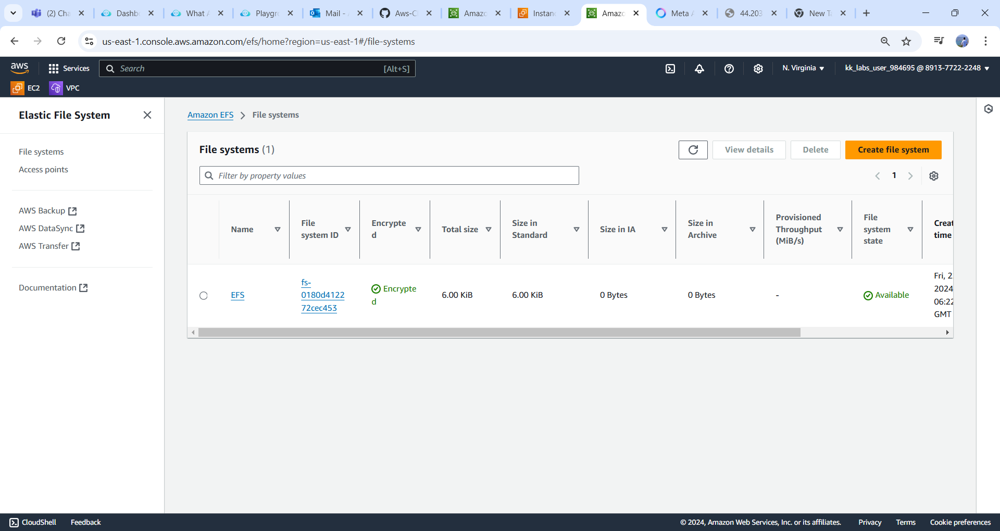

---

## Step 2: Create and Launch EC2 Instances

1. **Navigate to the EC2 Dashboard** in the AWS Management Console.
2. **Launch EC2 Instances**:
   - Click "Launch Instance."
   - Choose an Amazon Machine Image (AMI), such as **Amazon Linux 2**.
   - Select an instance type (e.g., `t2.micro` for the free tier).
   - Configure instance details, ensuring the instances are in the same VPC as your EFS.
   - **Add Storage**: Leave the default settings.
   - **Configure Security Group**: Allow inbound traffic on ports `22` (SSH),`2049` (NFS) and `3000` (for the chat application).
   - Review and launch the instance.
   
    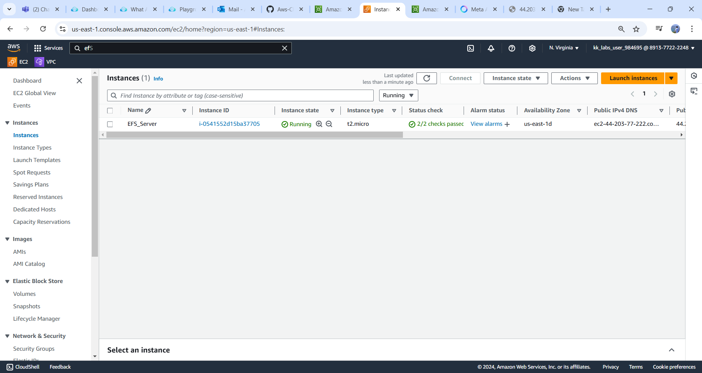
3. **Note the public DNS or IP address** of the instance for later use.

---

## Step 3: Mount EFS on the EC2 Instances

1. **SSH into Your EC2 Instance**:
   ```bash
   ssh -i your-key.pem ec2-user@your-instance-public-dns
   ```

   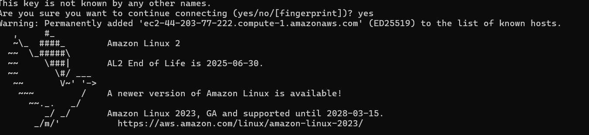
2. **Install the EFS Utilities**:
   ```bash
   sudo yum install -y amazon-efs-utils
   ```

   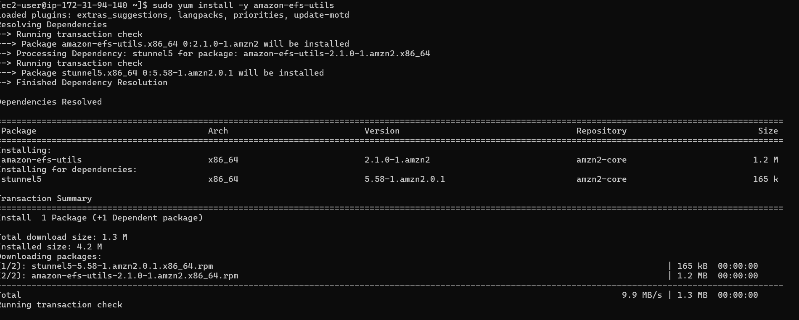
3. **Create a Mount Point**:
   ```bash
   sudo mkdir /mnt/efs
   ```

4. **Mount the EFS File System**:
   - Replace `fs-XXXXXX` with your EFS File System ID.
   ```bash
   sudo mount -t efs fs-XXXXXX:/ /mnt/efs
   ```

   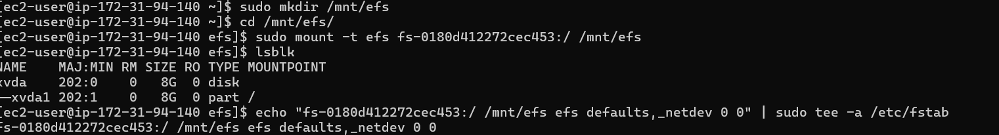
5. **Ensure EFS is Mounted on Reboot**:
   - Edit the fstab file:
   ```bash
   echo "fs-XXXXXX:/ /mnt/efs efs defaults,_netdev 0 0" | sudo tee -a /etc/fstab
   ```

---

## Step 4: Set Up the Node.js Application

1. **Install Node.js and NPM**:
   ```bash
   sudo yum install -y nodejs npm
   ```

* while installing node js and npm.I faced an issue which is command not found,so here troubleshooted by giving below commands

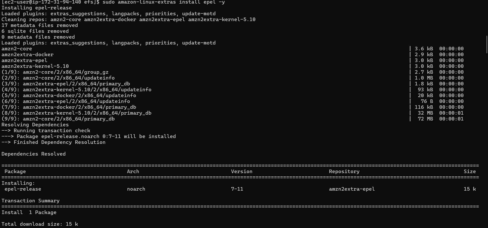
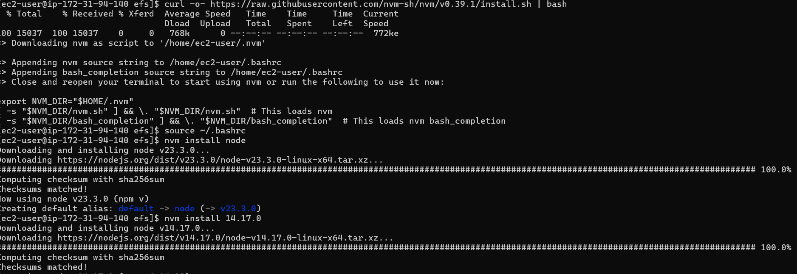

2. **Create a New Directory for Your Project**:
   ```bash
   mkdir /mnt/efs/chat-app
   cd /mnt/efs/chat-app
   ```
3. **Initialize a New Node.js Project**:
   ```bash
   npm init -y
   ```
4. **Install Required Packages**:
   ```bash
   npm install express ws body-parser
   ```

   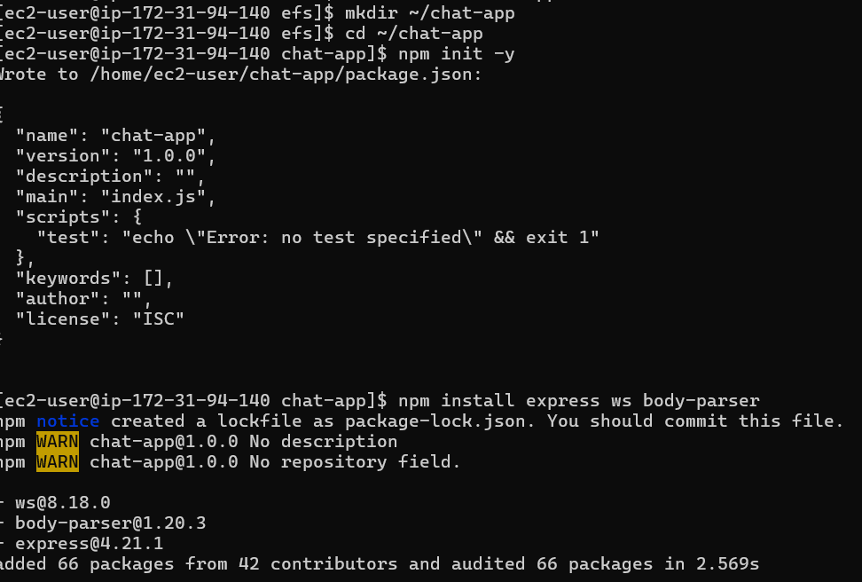
   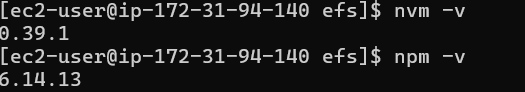
5. **Create the Server**:
   - Create a file named `server.js` with the following code:

   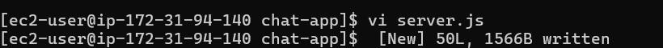

   ```javascript
   const express = require('express');
   const WebSocket = require('ws');
   const bodyParser = require('body-parser');
   const fs = require('fs');
   const path = require('path');

   const app = express();
   const server = require('http').createServer(app);
   const wss = new WebSocket.Server({ server });

   const DATA_FILE = '/mnt/efs/messages.txt'; // EFS file path

   app.use(bodyParser.json());
   app.use(express.static('public'));

   app.get('/messages', (req, res) => {
       fs.readFile(DATA_FILE, 'utf8', (err, data) => {
           if (err) return res.status(500).send('Error reading messages');
           res.send(data);
       });
   });

   wss.on('connection', (ws) => {
       console.log('New client connected');

       ws.on('message', (message) => {
           console.log(`Received: ${message}`);
           fs.appendFile(DATA_FILE, message + '\n', (err) => {
               if (err) console.error('Error saving message:', err);
           });

           // Broadcast the message to all connected clients
           wss.clients.forEach((client) => {
               if (client.readyState === WebSocket.OPEN) {
                   client.send(message);
               }
           });
       });

       ws.on('close', () => {
           console.log('Client disconnected');
       });
   });

   const PORT = process.env.PORT || 3000;
   server.listen(PORT, () => {
       console.log(`Server is running on port ${PORT}`);
   });
   ```
6. **Create a Simple HTML Client**:
   - Create a directory named `public`, and inside it, create an `index.html` file with the following code:

   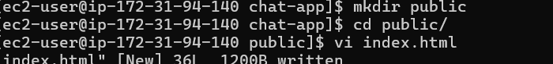
   
   ```html
   <!DOCTYPE html>
   <html>
   <head>
       <title>Real-Time Chat</title>
       <style>
           body { font-family: Arial, sans-serif; }
           #messages { border: 1px solid #ccc; height: 300px; overflow-y: scroll; }
       </style>
   </head>
   <body>
       <h1>Chat Room</h1>
       <div id="messages"></div>
       <input type="text" id="message" placeholder="Type a message..." />
       <button id="send">Send</button>

       <script>
           const ws = new WebSocket('ws://' + window.location.host);
           const messagesDiv = document.getElementById('messages');
           const messageInput = document.getElementById('message');

           ws.onmessage = function(event) {
               const message = document.createElement('div');
               message.textContent = event.data;
               messagesDiv.appendChild(message);
           };

           document.getElementById('send').onclick = function() {
               const message = messageInput.value;
               ws.send(message);
               messageInput.value = '';
           };
       </script>
   </body>
   </html>
   ```

---

## Step 5: Run Your Application

1. **Start the Server**:
   ```bash
   node server.js
   ```
   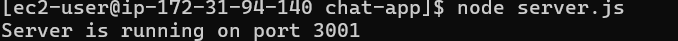
2. **Access Your Application**:
   - Open a web browser and navigate to `http://your-instance-public-dns:3000`.

---

   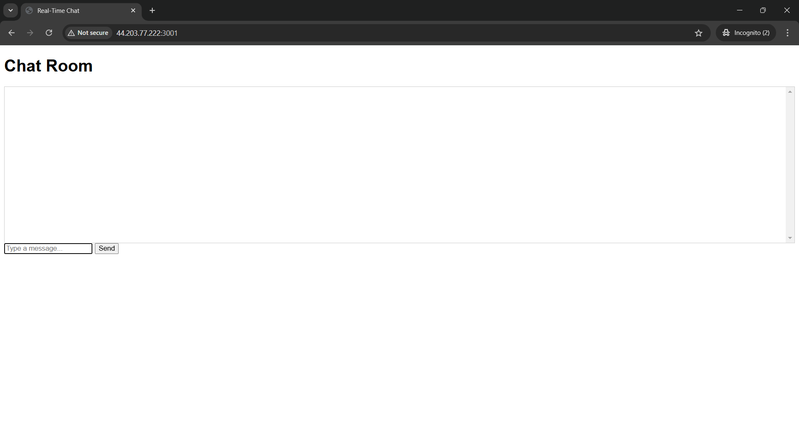
---

## Step 6: Cleanup

Once you're done with the project, be sure to:
- Terminate your EC2 instances.
- Delete the EFS file system to avoid unnecessary charges.

---

## Conclusion
 real-time chat application using AWS EC2 and EFS for storage! This architecture allows multiple EC2 instances to access and share chat messages in real-time.

---