# S3-Based Multimedia Storage and Management Solution

* Imagine a scenario where a media company needs to store high-resolution images and video content. The images/ folder is used for frequently accessed images, while videos/ are archived after a certain period. Content must be stored securely, with only authorized users able to access and manage files, while older files are automatically archived for cost efficiency.

### 1. Create an S3 Bucket with Appropriate Naming and Versioning
1. Navigate to the **Amazon S3 Console**.
2. Click **Create bucket**.
3. Enter a unique bucket name in the format: `multimedia-storage-[yourname]-bucket`.
4. Enable **Bucket Versioning**:
   - Scroll down to the "Bucket Versioning" section.
   - Select **Enable**.
5. Create the bucket by clicking **Create bucket**.
6. Upload a few files with the same name multiple times.
   - Observe how S3 maintains object versions by checking the "Versions" view in the console.
 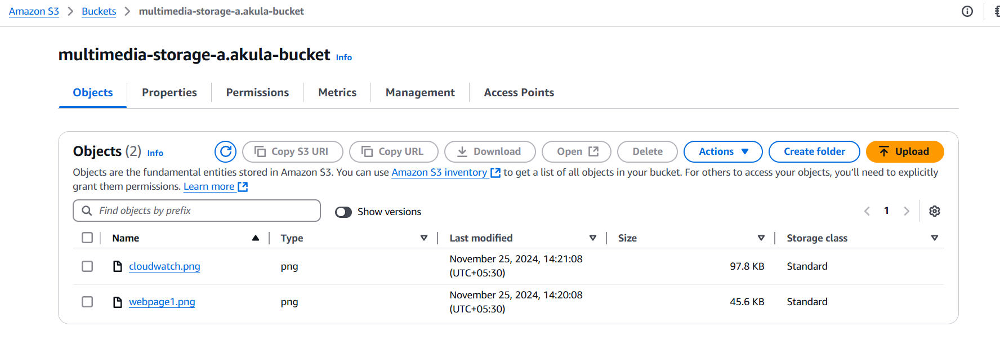

* After switching the versioining button

   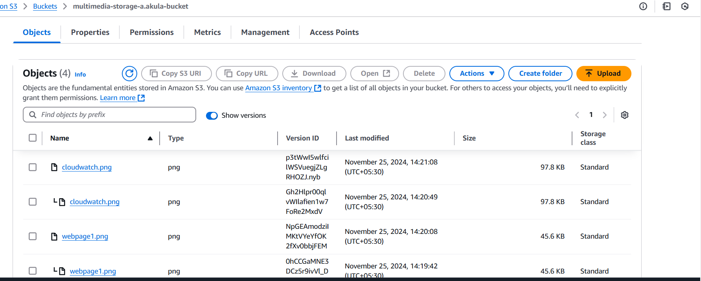
---

### 2. Organize Files Using Prefixes (Folders)
1. Open the newly created bucket.
2. Create a folder structure:
   - Click **Create folder**, and name it `images/`.
   - Repeat to create folders `videos/` and `documents/`.
   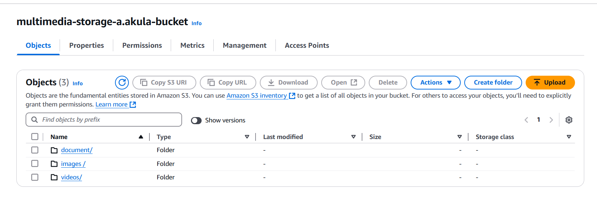
3. Upload several files into each folder to simulate directory structures.
4. Explore the concept of prefixes and how S3 simulates folder-like behavior.
   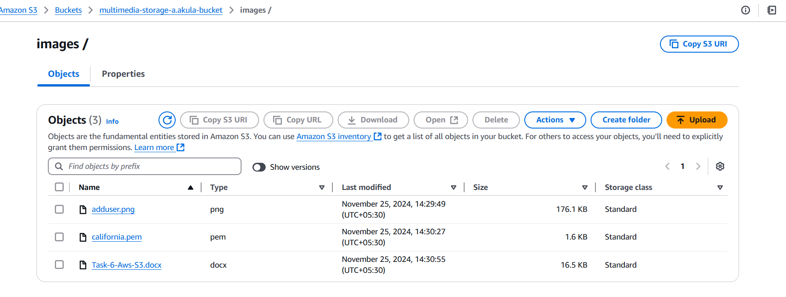
   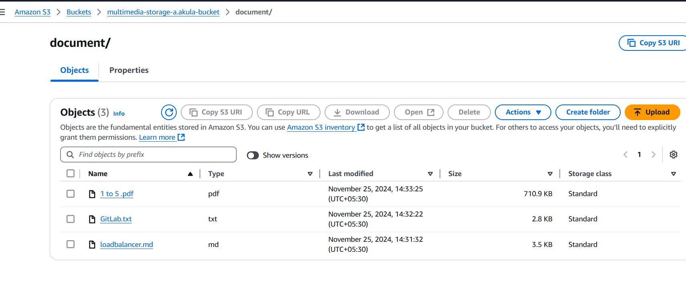

---

### 3. Implement Lifecycle Policies for Cost Optimization
1. Navigate to the **Management** tab of your bucket.
2. Click **Create lifecycle rule** and configure policies:
   - **Rule for `images/`:**
     - Name: `ImagesLifecycleRule`.
     - Scope: Apply to `images/`.
     - Transition objects to **S3 Standard-IA** after 30 days.
     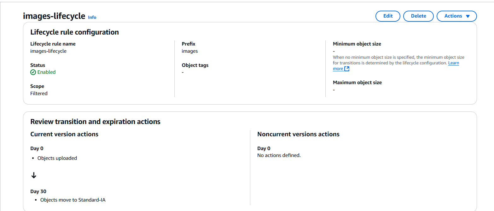
   - **Rule for `videos/`:**
     - Name: `VideosLifecycleRule`.
     - Scope: Apply to `videos/`.
     - Transition objects to **S3 Glacier** after 60 days and **delete them after 180 days**.
3. Save the rules and document:
   - Why these rules are optimized for access patterns and cost-efficiency.

   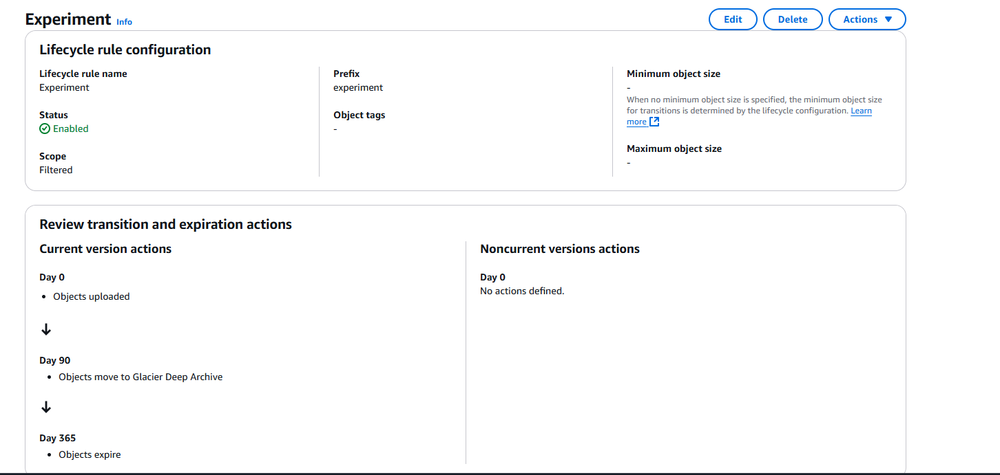

---

### 4. Enable Server-Side Encryption
1. Navigate to the **Properties** tab of your bucket.
2. In the **Default encryption** section, select **Edit**.
3. Choose the type of encryption:
   - **SSE-S3**: S3-managed keys.
   - **SSE-KMS**: AWS KMS-managed keys (requires setting up a KMS key).

   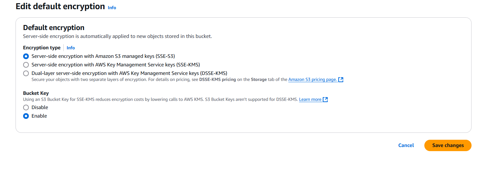
4. Save changes and note the differences:
   - **SSE-S3**: Fully managed by S3, no additional configuration.
   - **SSE-KMS**: Offers additional control and auditability with KMS.

---

### 5. Configure Access Controls and Bucket Policies
1. **Block Public Access**:
   - In the **Permissions** tab, ensure that "Block all public access" is enabled.

   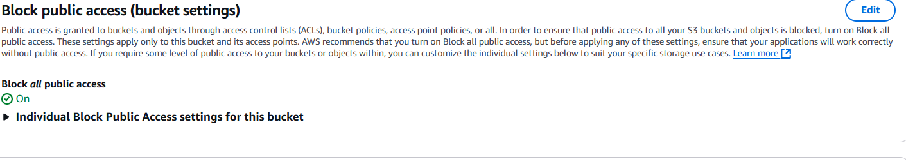
2. **Create a Bucket Policy**:
   - Example: Grant read-only access to a specific IAM role or user.

   ```json
   {
    "Version": "2012-10-17",
    "Statement": [
        {
            "Effect": "Allow",
            "Principal": {
                "AWS": "arn:aws:iam::339712894090:role/s3"
            },
            "Action": "s3:GetObject",
            "Resource": "arn:aws:s3:::mymultimedia-buckets3/*"
        }
    ]
}


3. **use ACLs**:
 - Grant specific permissions to individual users or groups for fine-grained control.

4. Review and document how permissions are defined and restricted.


### 6. Set Up S3 Event Notifications for File Management Automation
1. Navigate to the **Properties** tab of your bucket.
2. Under **Event notifications**, click **Create event notification**.

  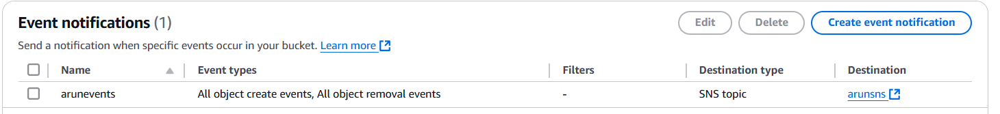

3. Configure the notification:  
   - Name: `FileUploadNotification`.
   - Event type: `s3:ObjectCreated:*`.

   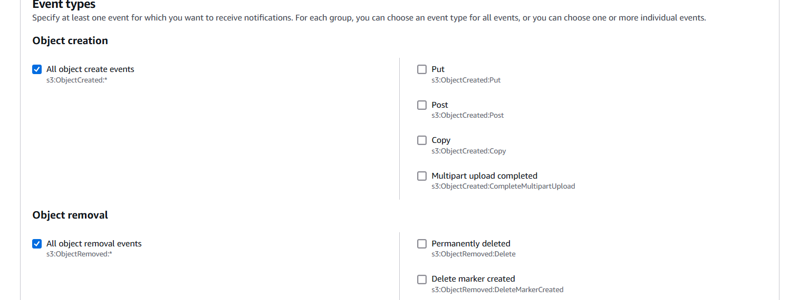

   - Destination: Select **Amazon SNS** topic or email.
   - create an sns topic

   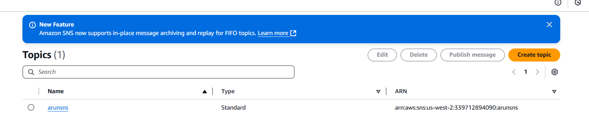
   
   - delete an object from your bucket and check the email confirmation

   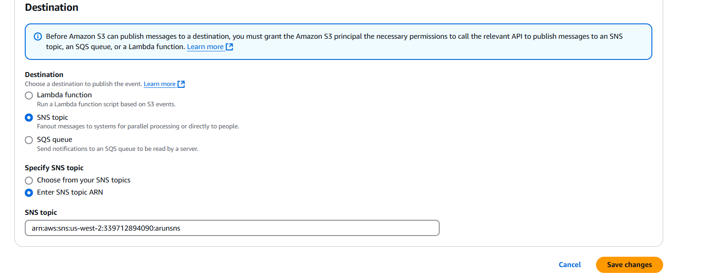

4. Test the notification:
   - Upload and delete files to observe the configured notifications.

   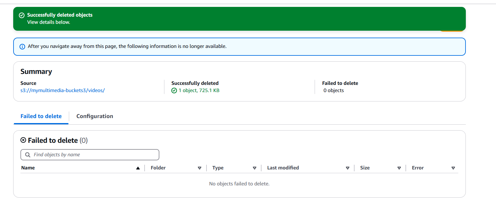

   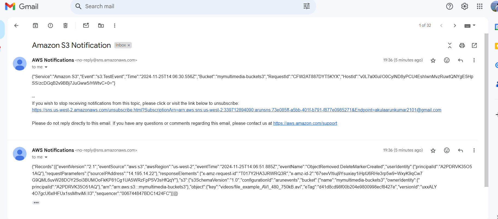


### Conclusion
- Organizes, secures, and manages multimedia content.
- Optimizes costs with lifecycle policies.
- Automates file management with event notifications.
- Ensures data availability and redundancy using cross-region replication.